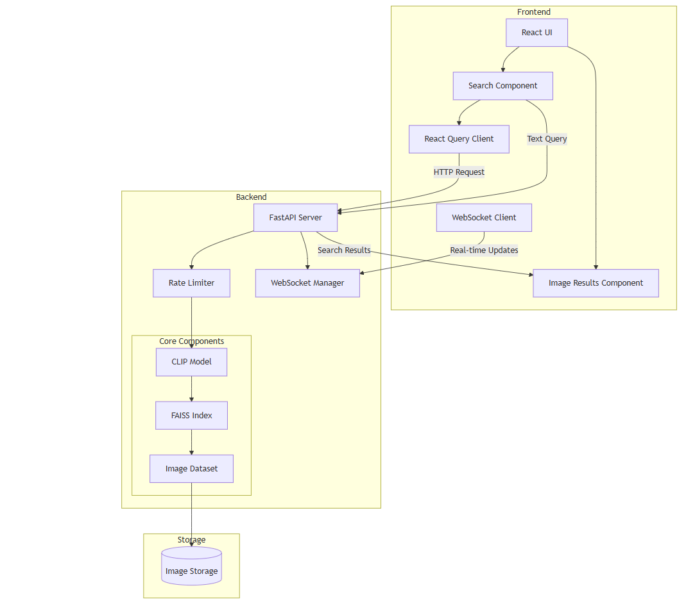

# Multi-Modal Image Retrieval System

System for retrieving images using natural language queries. The system uses CLIP (Contrastive Language-Image Pre-Training) for multi-modal understanding and FAISS for efficient similarity search.



## Features
- Natural language image search using OpenAI's CLIP model
- Efficient similarity search with Facebook AI's FAISS
- Modern React frontend with Material-UI
- FastAPI backend with async support

## System Architecture

```
├── backend/                 # Python backend
│   ├── requirements.txt     # Python dependencies
│   ├── src/
│   │   ├── api/             # FastAPI application
│   │   ├── data/            # Data loading and processing
│   │   ├── models/          # ML models and retrieval system
│   │   └── utils/           # Utility functions
│   └── tests/               # Backend tests
└── frontend/                # React frontend
    ├── public/
    ├── src/
    │   ├── components/      # React components
    │   ├── hooks/           # Custom React hooks
    │   ├── services/        # API services
    │   ├── styles/          # CSS styles
    │   └── utils/           # Utility functions
    └── package.json         # Frontend dependencies
```

## Prerequisites

### Backend Requirements
- Python 3.8+
- CUDA-capable GPU (recommended for faster CLIP model inference)
- 8GB RAM minimum, 16GB recommended
- Storage space for image database
- Required Python packages:
  - FastAPI
  - Uvicorn
  - PyTorch
  - CLIP
  - FAISS-gpu (or FAISS-cpu)
  - Pillow
  - Python-multipart
  - SpeechRecognition
  - gTTS (Google Text-to-Speech)
  - PyAudio
  - Transformers
  - NumPy
  - Pandas

### Frontend Requirements
- Node.js 14+
- npm 6+
- Modern web browser with support for:
  - WebSpeech API
  - WebAudio API
  - ARIA support
  - LocalStorage
- Required npm packages:
  - React 17+
  - Material-UI 5+
  - React-Speech-Recognition
  - React-Speech-Kit
  - Axios
  - Web Accessibility Tools:
    - @axe-core/react
    - react-aria
    - react-focus-lock

### System Requirements
- Operating System: Windows 10/11, macOS, or Linux
- Disk Space: Minimum 10GB free space
- Internet Connection: Required for model downloads and API calls
- Microphone: Required for voice command features
- Speakers/Headphones: Required for audio feedback

## Installation

1. Clone the repository:
- git clone https://github.com/MackLetladi/multi-modal-image-retrieval-system-main.git

## Assumptions

1. Using a sample of 500 images from the test_data_v2 folder
2. Images are in JPEG format
3. CLIP model is suitable for general image retrieval tasks
4. Users have basic familiarity with web interfaces


## BackEnd
- Install Conda
- Install Pycharm or any IDE of your choice
- Create an environment variable
- open a terminal and use the following command: conda create --name myenv python=3.11
- In the IDE make sure that you selected the newly created interpreter
- Install Cuda from the following link we used CUDA 12:
- - https://developer.nvidia.com/cuda-downloads?target_os=Windows&target_arch=x86_64&target_version=10&target_type=exe_local
- Install PyTorch: 
- - pip3 install torch torchvision torchaudio --index-url https://download.pytorch.org/whl/cu124
- pip install -r requirements.txt
- Make Sure the environment is properly activated: 
  - Windows: activate "name" 
  - Unix: source activate "name"
- python download_dataset.py
- cd to the folder backend make sure the right environment is activated:
  - run the following commands: make sure you are in the correct folder :
    - python main 


## FrontEnd
- cd to the folder frontend: run the following commands:
- npm install
- npm run start

## Running Tests

Backend tests:
\`\`\`bash
cd backend
pytest
\`\`\`

Frontend tests:
\`\`\`bash
cd frontend
npm test
\`\`\`

## API Documentation

Once the backend and frontend is running, visit http://localhost:8000/ for the interactive API documentation.
